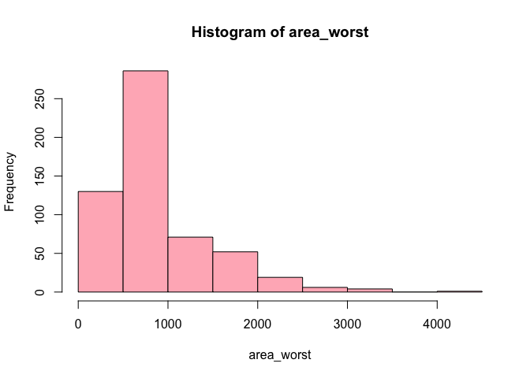
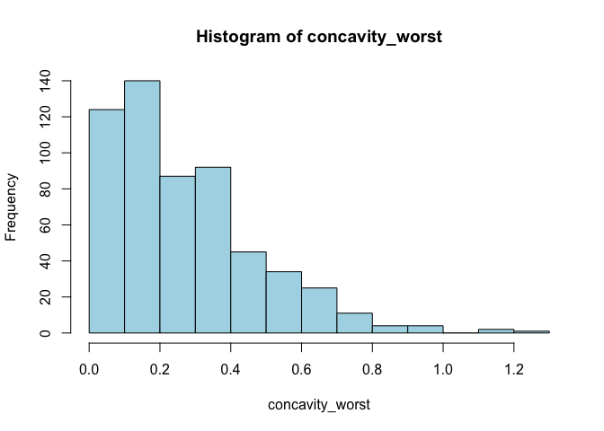
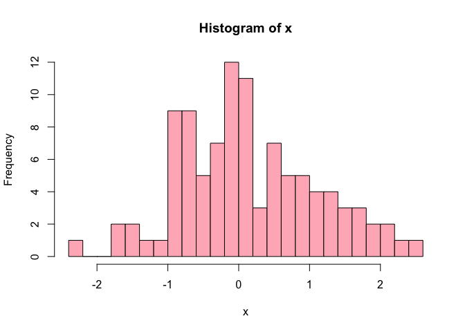

Assignment B1
================
Jasleen Kaur
2023-11-01

``` r
library(tidyverse)
library(testthat)
library(roxygen2)
```

Before we create a function, we need a dataset. For this project we will
work with the `cancer_sample` dataset from `datateachr` package, since
we explored the dataset previously.

First we load the `cancer_sample` dataset by loading the `datateachr`
package as follows:

``` r
library(datateachr)
```

Now before we begin with the main task, lets quickly explore the
dataset, to understand it. We will use some basic `dplyr` functions to
understand and explore the dataset.

``` r
cancer_sample %>% 
  glimpse()
```

    ## Rows: 569
    ## Columns: 32
    ## $ ID                      <dbl> 842302, 842517, 84300903, 84348301, 84358402, …
    ## $ diagnosis               <chr> "M", "M", "M", "M", "M", "M", "M", "M", "M", "…
    ## $ radius_mean             <dbl> 17.990, 20.570, 19.690, 11.420, 20.290, 12.450…
    ## $ texture_mean            <dbl> 10.38, 17.77, 21.25, 20.38, 14.34, 15.70, 19.9…
    ## $ perimeter_mean          <dbl> 122.80, 132.90, 130.00, 77.58, 135.10, 82.57, …
    ## $ area_mean               <dbl> 1001.0, 1326.0, 1203.0, 386.1, 1297.0, 477.1, …
    ## $ smoothness_mean         <dbl> 0.11840, 0.08474, 0.10960, 0.14250, 0.10030, 0…
    ## $ compactness_mean        <dbl> 0.27760, 0.07864, 0.15990, 0.28390, 0.13280, 0…
    ## $ concavity_mean          <dbl> 0.30010, 0.08690, 0.19740, 0.24140, 0.19800, 0…
    ## $ concave_points_mean     <dbl> 0.14710, 0.07017, 0.12790, 0.10520, 0.10430, 0…
    ## $ symmetry_mean           <dbl> 0.2419, 0.1812, 0.2069, 0.2597, 0.1809, 0.2087…
    ## $ fractal_dimension_mean  <dbl> 0.07871, 0.05667, 0.05999, 0.09744, 0.05883, 0…
    ## $ radius_se               <dbl> 1.0950, 0.5435, 0.7456, 0.4956, 0.7572, 0.3345…
    ## $ texture_se              <dbl> 0.9053, 0.7339, 0.7869, 1.1560, 0.7813, 0.8902…
    ## $ perimeter_se            <dbl> 8.589, 3.398, 4.585, 3.445, 5.438, 2.217, 3.18…
    ## $ area_se                 <dbl> 153.40, 74.08, 94.03, 27.23, 94.44, 27.19, 53.…
    ## $ smoothness_se           <dbl> 0.006399, 0.005225, 0.006150, 0.009110, 0.0114…
    ## $ compactness_se          <dbl> 0.049040, 0.013080, 0.040060, 0.074580, 0.0246…
    ## $ concavity_se            <dbl> 0.05373, 0.01860, 0.03832, 0.05661, 0.05688, 0…
    ## $ concave_points_se       <dbl> 0.015870, 0.013400, 0.020580, 0.018670, 0.0188…
    ## $ symmetry_se             <dbl> 0.03003, 0.01389, 0.02250, 0.05963, 0.01756, 0…
    ## $ fractal_dimension_se    <dbl> 0.006193, 0.003532, 0.004571, 0.009208, 0.0051…
    ## $ radius_worst            <dbl> 25.38, 24.99, 23.57, 14.91, 22.54, 15.47, 22.8…
    ## $ texture_worst           <dbl> 17.33, 23.41, 25.53, 26.50, 16.67, 23.75, 27.6…
    ## $ perimeter_worst         <dbl> 184.60, 158.80, 152.50, 98.87, 152.20, 103.40,…
    ## $ area_worst              <dbl> 2019.0, 1956.0, 1709.0, 567.7, 1575.0, 741.6, …
    ## $ smoothness_worst        <dbl> 0.1622, 0.1238, 0.1444, 0.2098, 0.1374, 0.1791…
    ## $ compactness_worst       <dbl> 0.6656, 0.1866, 0.4245, 0.8663, 0.2050, 0.5249…
    ## $ concavity_worst         <dbl> 0.71190, 0.24160, 0.45040, 0.68690, 0.40000, 0…
    ## $ concave_points_worst    <dbl> 0.26540, 0.18600, 0.24300, 0.25750, 0.16250, 0…
    ## $ symmetry_worst          <dbl> 0.4601, 0.2750, 0.3613, 0.6638, 0.2364, 0.3985…
    ## $ fractal_dimension_worst <dbl> 0.11890, 0.08902, 0.08758, 0.17300, 0.07678, 0…

Now, while the `glimpse` function showed that there are 562 rows and 32
columns, we are not interested with working with all the columns
together. So we shall narrow down to the columns or variables we are
interested in, and we shall try to establish a function. This function
can be used with other cells of these variables to determine the
relation or perform the function or action.

So let’s break down the above explanation first. Let’s think of a task
we would like to perform with this dataset. One of the task we performed
previously in the `MDA project 2` was visualizing the data using a
histogram. Therefore, our aim is to create a histogram function that
will help us analyze the distribution of the data under study.

First, we begin by making sure that the input variables used in this
function follow a certain set rules. For example we make sure that the
data being used is a `dataframe`, the input columns used to execute our
function are numerical, etc. We need to make sure that the function runs
smoothly but also takes in correct input and to compute the output.

We also include the `Roxygen2` documentation to make things easier to
understand.

``` r
#' Create a Histogram
#'
#' This function generates a histogram for a numeric variable in a given data frame.
#'
#' @param data A data frame containing the dataset.
#' @param var The name of the numeric variable to create a histogram for.
#' @param bins The number of bins for the histogram (default is 10).
#' @param col The color of the histogram bars (default is "blue").
#'
#'
#' @examples
#' data <- data.frame(x = rnorm(100))
#' hist1 <- histogram(data, var = "x", bins = 20, col = "green")
#' print(hist1)
#'
#'
#' @export
histogram <- function(data, var, bins = 10, col = "lightpink") {
  # check if the data is a data frame
  if (!is.data.frame(data)) {
    stop("The input must be a data frame.")
  }
  # check if the variable is a character string
  if (!is.character(var)) {
    stop("The variable must be a character string.")
  }
  # check if the variable exists in the data
  if (!var %in% names(data)) {
    stop("The variable does not exist in the data.")
  }
  # check if the variable is numeric
  if (!is.numeric(data[[var]])) {
    stop("The variable must be numeric.")
  }
   #plot a histogram of the variable
   hist(data[[var]], breaks = bins, col = col, main = paste("Histogram of", var), xlab = var)
}
```

Now let’s check our function! We need to make sure our function runs
smoothly. Also this could serve as example on how to use the function we
created.

``` r
# Install datateachr package if not already installed
if (!require(datateachr)) {
  install.packages("datateachr")
}

# Load the library
library(datateachr)

# Load the data
data <- cancer_sample
```

``` r
# Create a histogram with the default arguments
hist1 <- histogram(data, var = "area_worst")
```

<!-- -->

``` r
print(hist1)
```

    ## $breaks
    ##  [1]    0  500 1000 1500 2000 2500 3000 3500 4000 4500
    ## 
    ## $counts
    ## [1] 130 286  71  52  19   6   4   0   1
    ## 
    ## $density
    ## [1] 4.569420e-04 1.005272e-03 2.495606e-04 1.827768e-04 6.678383e-05
    ## [6] 2.108963e-05 1.405975e-05 0.000000e+00 3.514938e-06
    ## 
    ## $mids
    ## [1]  250  750 1250 1750 2250 2750 3250 3750 4250
    ## 
    ## $xname
    ## [1] "data[[var]]"
    ## 
    ## $equidist
    ## [1] TRUE
    ## 
    ## attr(,"class")
    ## [1] "histogram"

``` r
# Create a histogram with different arguments
hist2 <- histogram(data, var = "concavity_worst", bins = 15, col = "lightblue")
```

<!-- -->

``` r
print(hist2)
```

    ## $breaks
    ##  [1] 0.0 0.1 0.2 0.3 0.4 0.5 0.6 0.7 0.8 0.9 1.0 1.1 1.2 1.3
    ## 
    ## $counts
    ##  [1] 124 140  87  92  45  34  25  11   4   4   0   2   1
    ## 
    ## $density
    ##  [1] 2.17926186 2.46045694 1.52899824 1.61687170 0.79086116 0.59753954
    ##  [7] 0.43936731 0.19332162 0.07029877 0.07029877 0.00000000 0.03514938
    ## [13] 0.01757469
    ## 
    ## $mids
    ##  [1] 0.05 0.15 0.25 0.35 0.45 0.55 0.65 0.75 0.85 0.95 1.05 1.15 1.25
    ## 
    ## $xname
    ## [1] "data[[var]]"
    ## 
    ## $equidist
    ## [1] TRUE
    ## 
    ## attr(,"class")
    ## [1] "histogram"

``` r
# Try to create a histogram with an invalid argument
hist3 <- histogram(data, var = "diagnosis")
```

    ## Error in histogram(data, var = "diagnosis"): The variable must be numeric.

``` r
library(testthat)

# Test 1: Provide a valid input and check if it returns a ggplot object
test_that("histogram function works as expected with valid input", {
  data <- data.frame(x = rnorm(100))
  var <- "x"
  hist1 <- histogram(data, var = var, bins = 20, col = "lightpink")
  expect_is(hist1, "histogram", info = "Should return a histogram object")
})
```

<!-- -->

    ## Test passed 🥳

``` r
# Test 2: Check if the function raises an error for invalid input
test_that("histogram function raises an error for an invalid input", {
  data <- data.frame(y = "text")
  var <- "y"
  expect_error(histogram(data, var = var), "The variable must be numeric")
})
```

    ## Test passed 😸

``` r
# Test 3: Provide an invalid input and check if it throws an error
test_that("histogram function throws an error for an invalid input", {
  data <- data.frame(z = "notnumeric")
  var <- "z"
  expect_error(histogram(data, var = var), "The variable must be numeric", 
    info = "Should throw an error for an invalid input")
})
```

    ## Test passed 🌈
